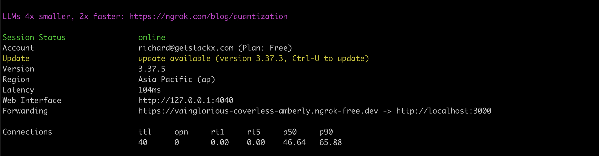
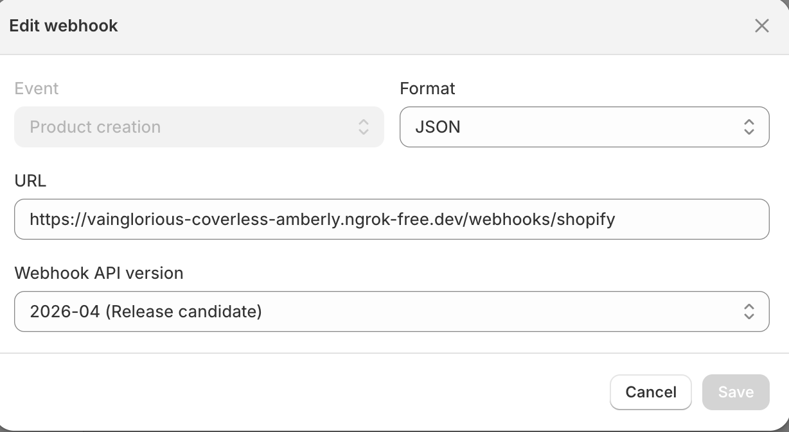

# README

## Installing
### Install rails app

```
$ git clone <repos>
$ cd shopify_integration
$ bunlde install
$ rails s
```

### Ngrok

a. Sign up your account on Ngrok

b. Install Ngrok on device(for Mac)
```
$ curl -L https://bin.equinox.io/c/bNyj1mQVY4c/ngrok-v3-stable-darwin-amd64.zip -o ngrok.zip
$ unzip ngrok.zip
$ chmod +x ngrok
$ sudo mv ngrok /usr/local/bin
$ ngrok version
$ ngrok config add-authtoken <YOUR_NGROK_AUTHTOKEN>
$ ngrok http 3000
```
On the Forwarding, the first path is the exposed domain to add to webhook URL

### Shopify Store
a. Create your store on Shopify

b. From admin site, access Settings > Notifications > Webhook

c. Create Webhook

Url: <ngrok domain>/webhooks/shopify

*Notes: There is a file name api.json created when the event is triggered*
